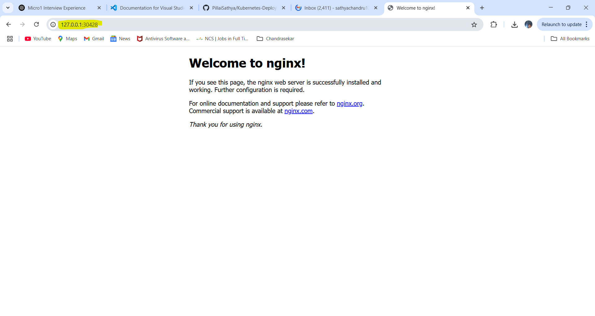

# Kubernetes Deployment - NGINX Deployment Demo

## ✨ Overview
This demo showcases how to create a **Kubernetes Deployment** that manages multiple replicas of an NGINX web server.

---

## 🖊️ YAML Configuration: `nginx-deployment.yaml`
```yaml
apiVersion: apps/v1
kind: Deployment
metadata:
  name: nginx-deployment
spec:
  replicas: 3
  selector:
    matchLabels:
      app: nginx
  template:
    metadata:
      labels:
        app: nginx
    spec:
      containers:
      - name: nginx
        image: nginx
        ports:
        - containerPort: 80
```

### Explanation:
- **replicas: 3**: Ensures 3 pods are always running.
- **selector**: Matches the label `app: nginx` to group the pods.
- **template**: Defines the pod structure, including the NGINX container.

---

## ⚙️ Commands Used
```bash
# Create the deployment
kubectl apply -f nginx-deployment.yaml

# View the pods created
kubectl get pods

# Expose the deployment to create a service
kubectl expose deployment nginx-deployment --port=80 --type=NodePort

# View the service and access port
kubectl get svc
```

---

## 🌐 Access the Application
After exposing the deployment, you'll get a **NodePort** like:
```txt
80:31204/TCP
```
You can access NGINX in the browser at:
```
http://127.0.0.1:31204
```

---

## 🚀 Benefits of Deployment
- Easy scaling (change `replicas` value).
- Automatic self-healing of pods.
- Controlled rolling updates and rollbacks.

---

## 📷 Screenshot
Include a screenshot of the browser displaying the NGINX welcome page via `http://127.0.0.1:<NodePort>`.


---

## 📁 Files in this Project
- `nginx-deployment.yaml`
- `nginx-loadbalancer.yaml`
- `README.md`
- (optional) `screenshot.png`

---

---🧪 Additional Exploration – LoadBalancer Service (Local Demo)
Although LoadBalancer type services are designed for cloud environments (like AWS or GCP), I attempted to simulate this locally using Docker Desktop’s Kubernetes:

bash

kubectl expose deployment nginx-deployment --type=LoadBalancer --name=nginx-loadbalancer
This created a service:

bash
kubectl get svc

Output:
nginx-loadbalancer   LoadBalancer   10.109.6.166    localhost   80:32089/TCP
🔍 However, when I accessed http://localhost:32089, the connection was refused.
This is expected, as Docker Desktop doesn’t provision a real cloud LoadBalancer.

✅ To verify NGINX was working, I ran:

bash
kubectl exec -it <nginx-pod-name> -- curl localhost
and got the default Welcome to NGINX page.

✅ Later, I tested again by manually creating a NodePort on a free port 8085, and it worked via:
📎 http://127.0.0.1:8085

📝 This demo shows LoadBalancer services don’t work natively on local Docker Desktop, but the concept is practiced here for readiness in a cloud Kubernetes setup.

📖 Learn more about LoadBalancer: https://kubernetes.io/docs/concepts/services-networking/service/

## 🌟 Author
**Sathya**  
DevOps Enthusiast | Docker & Kubernetes Learner

---

## 🔗 GitHub
[GitHub Repository →](https://github.com/PillaiSathya/Kubernetes-Deployment-Demo)


