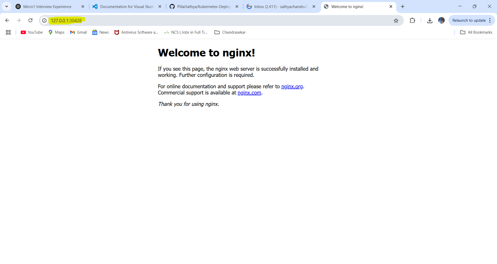

# Kubernetes Deployment - NGINX Deployment Demo

## ✨ Overview
This demo showcases how to create a **Kubernetes Deployment** that manages multiple replicas of an NGINX web server.

---

# 🚀 Kubernetes: Container → Pod → Deployment

## 🔹 Container

- A **container** is the smallest unit that packages an application with its dependencies.
- Example (Docker):
  ```bash
  docker run -d -p 8080:80 nginx

👉 Runs one container with Nginx.
```
---

## 🔹 Pod

- In Kubernetes, you don’t run containers directly → you run them inside Pods.
- A Pod is a wrapper around one or more containers that:
- Share the same network (same IP).
- Share the same storage (volumes).
- Most Pods have one container, but sometimes we put multiple if they depend on each other (e.g., app + logging sidecar).

📄 Example: pod.yaml
``` 
apiVersion: v1
kind: Pod
metadata:
  name: nginx-pod
spec:
  containers:
    - name: nginx
      image: nginx
      ports:
        - containerPort: 80
```
---
## 🔹 Deployment

A Deployment manages Pods automatically.

Deployment → creates ReplicaSets → which create/manage Pods.

Benefits:

✅ Auto-healing (if a Pod crashes, new one is created).
✅ Auto-scaling (increase replicas when load is high).
✅ Zero downtime deployments (rolling updates).

Ensures the desired state = actual state in the cluster.

📄 Example: nginx-deployment.yaml
```
apiVersion: apps/v1
kind: Deployment
metadata:
  name: nginx-deployment
spec:
  replicas: 2
  selector:
    matchLabels:
      app: nginx
  template:
    metadata:
      labels:
        app: nginx
    spec:
      containers:
        - name: nginx
          image: nginx:latest
          ports:
            - containerPort: 80
```
---
## 🔹 How They Connect

- Container = the app itself (built with Docker).
- Pod = Kubernetes wrapper that runs one or more containers.
- Deployment = High-level manager that creates ReplicaSets → which ensure Pods are always running.

## 📌 Flow: 

Deployment → ReplicaSet → Pod → Container

---

## 🔹 Common kubectl Commands

- `kubectl get pods` ➡️ Lists all Pods in the current namespace.

- `kubectl get deploy` ➡️ Shows all Deployments in the current namespace.

- `kubectl get all` ➡️ Shows all resources in the current namespace (Pods, Services, Deployments, ReplicaSets, etc.)

- `kubectl get all -A` ➡️ Shows all resources across all namespaces.Useful for debugging cluster-wide.

- `kubectl get pods -o wide` ➡️ Same as kubectl get pods but with more details like node name, IP address.

- `kubectl describe pods` ➡️
Gives detailed info about a Pod:
Events (why it failed or restarted)
Container image
Ports, Volumes
 
- `kubectl apply -f nginx-deployment.yaml` ➡️ Applies a YAML file (creates/updates resources).

- `kubectl get rs` ➡️
Shows all ReplicaSets (which are created automatically by Deployments).
ReplicaSet ensures the desired number of Pods are running.

- `kubectl get pods -w` ➡️
-w = watch mode.
Continuously shows Pod status changes in real time (great for seeing scaling or rolling updates live).

## 🔹 Easy Way to Remember

- get pods → show me Pods.
- get deploy → show me Deployments.
- get rs → show me ReplicaSets.
- get all → show me everything. 
- -A → across all namespaces.
- -o wide → more details.
- describe → deep dive into one resource.
- apply -f → create/update from YAML.
- -w → watch changes liv

## 🔹 Minikube

Minikube is a local single-node Kubernetes cluster.
Access the node:
minikube ssh

---

## 🔹 Quick Recap

- Container → Smallest unit (app + dependencies).

- Pod → Kubernetes unit that runs containers (with shared network/storage).

- Deployment → Manages Pods with ReplicaSets (adds auto-healing, scaling, rolling updates).

- ReplicaSet → Kubernetes controller ensuring desired number of Pods run at all times.

- 📌 Final Flow:
Deployment → ReplicaSet → Pod → Container

---

## 🌐 Access the Application

After exposing the deployment, you'll get a **NodePort** like:

```txt
80:31204/TCP
```
You can access NGINX in the browser at:
```
http://127.0.0.1:31204
```
---

## 🚀 Benefits of Deployment
- Easy scaling (change `replicas` value).
- Automatic self-healing of pods.
- Controlled rolling updates and rollbacks.

---

## 📷 Screenshot
Include a screenshot of the browser displaying the NGINX welcome page via `http://127.0.0.1:<NodePort>`.


---

## 📁 Files in this Project
- `nginx-deployment.yaml`
- `nginx-loadbalancer.yaml`
- `README.md`
- (optional) `screenshot.png`

---

### 🧪 Additional Exploration – LoadBalancer Service (Local Demo)

Although LoadBalancer type services are designed for cloud environments (like AWS or GCP), I attempted to simulate this locally using Docker Desktop’s Kubernetes:

````bash
kubectl expose deployment nginx-deployment --type=LoadBalancer --name=nginx-loadbalancer
```
This created a service:

```bash
kubectl get svc
```

Output:
nginx-loadbalancer   LoadBalancer   10.109.6.166    localhost   80:32089/TCP
🔍 However, when I accessed http://localhost:32089, the connection was refused.
This is expected, as Docker Desktop doesn’t provision a real cloud LoadBalancer.

✅ To verify NGINX was working, I ran:
```bash
kubectl exec -it <nginx-pod-name> -- curl localhost
```
and got the default Welcome to NGINX page.

✅ Later, I tested again by manually creating a NodePort on a free port 8085, and it worked via:
📎 http://127.0.0.1:8085

📝 This demo shows LoadBalancer services don’t work natively on local Docker Desktop, but the concept is practiced here for readiness in a cloud Kubernetes setup.

🔗 Accessing the LoadBalancer Service Locally (via Port Forward)
Since Docker Desktop’s Kubernetes setup doesn’t assign a real external IP for LoadBalancer type services, we use port forwarding to access them locally.

Run this command in your terminal:

```bash
kubectl port-forward service/nginx-loadbalancer 8085:80
```
Then visit http://localhost:8085 in your browser to see the NGINX welcome page.

💡 Note: Keep the terminal open while port forwarding is active. Press Ctrl + C to stop.


📖 Learn more about LoadBalancer: https://kubernetes.io/docs/concepts/services-networking/service/

## 🌟 Author
**Sathya**  
DevOps Enthusiast | Docker & Kubernetes Learner

---

## 🔗 GitHub
[GitHub Repository →](https://github.com/PillaiSathya/Kubernetes-Deployment-Demo)


