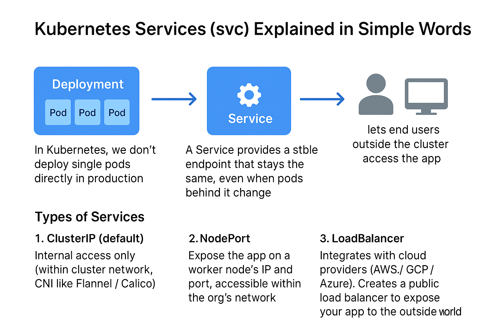

# 🚀 Kubernetes Services (svc) Explained in Simple Words

In **Kubernetes (K8s)**, we don’t deploy single pods directly in production — instead, we deploy **Deployments**.

👉 Each Deployment manages **ReplicaSets**, and ReplicaSets manage **Pods**.

But here’s the issue: Pods are **ephemeral**. If a pod crashes, K8s auto-heals it by creating a new one with a **different IP address**.

- Example: You had 3 pods running your app.  
- One pod goes down → K8s spins up another → but with a new IP.  
- Clients calling the old IP will fail.  

This is where a **Service (svc)** comes in.

---

## 🔹 Why Services?

A Service provides a **stable endpoint** (fixed IP or DNS name) that stays the same, even when pods behind it change.  

- Uses **labels and selectors** to track pods instead of relying on their IPs.  
- **kube-proxy** handles load balancing across all healthy pods.  

So instead of calling a pod IP, clients can call something like:  

payment.default.svc

---

## 🔑 What Services Provide

1. **Load Balancing** – distributes traffic across multiple pods.  
2. **Service Discovery** – finds pods by labels/selectors, not by changing IPs.  
3. **External Exposure** – lets end users outside the cluster access the app.  

---

## 🌐 Types of Services

1. **ClusterIP (default)**  
   - Internal access only.  
   - Accessible only within the cluster network (CNI like Flannel/Calico).  

2. **NodePort**  
   - Exposes the app on a worker node’s IP and port.  
   - Accessible within the organisation’s network (e.g., EC2 instance IP in AWS).  

3. **LoadBalancer**  
   - Integrates with cloud providers (AWS/GCP/Azure).  
   - Creates a public load balancer (e.g., ELB in EKS) to expose your app to the outside world.  

---

## 📊 Visual Representation

---

✅ In short: **Services make Kubernetes apps reliable, discoverable, and accessible — without worrying about pod IP changes.**
